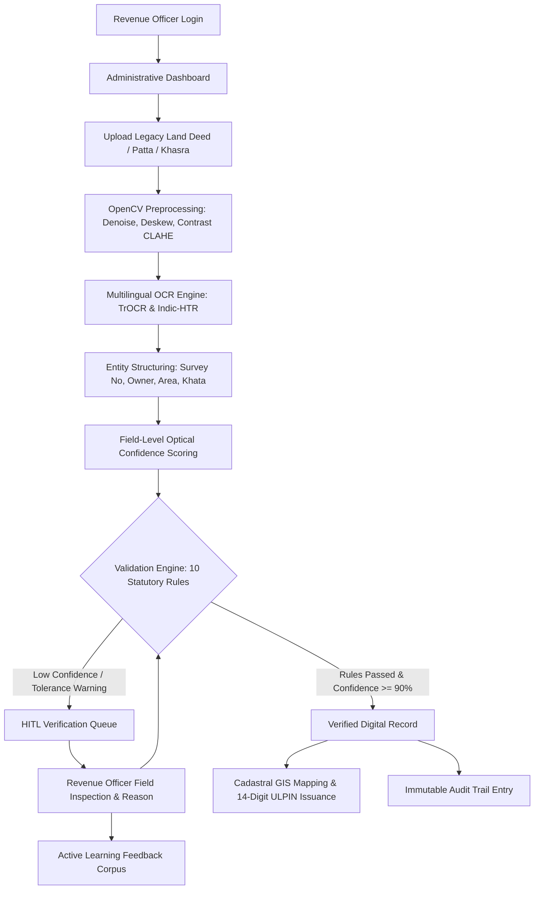

# Intelligent Land Record Digitization and Validation System (ILRDVS)

<<<<<<< HEAD
**Smart India Hackathon 2026 (SIH 2026)**  
**Problem Statement ID:** 26018  
**Ministry / Dept:** Ministry of Rural Development — Department of Land Resources (DoLR)  
**Category & Theme:** Software | Smart Automation  
**Standards:** Compliant with Digital India Land Records Modernization Programme (DILRMP) & Unique Land Parcel Identification Number (ULPIN / Bhu-Aadhaar)

---

## 1. Executive Summary & Problem Overview

Land records form the backbone of land administration, property ownership, taxation, infrastructure planning, and civil dispute resolution in India. A substantial volume of historical land records continues to exist in the form of handwritten registers, scanned documents, cadastral maps, and legacy PDF files. 

Manual digitization is slow, error-prone, and prone to duplicate or fraudulent entries. **ILRDVS** is an enterprise-grade administrative system engineered specifically for land revenue departments to automate the ingestion, image restoration, multilingual OCR/HTR, structured entity extraction, and automated cross-validation of historical land documents against master revenue registries.

---

## 2. Main User & System Workflow

```mermaid
flowchart TD
    A[Login / Session] --> B[Administrative Dashboard]
    B --> C[Upload Legacy Document PDF / JPG]
    C --> D[OpenCV Preprocessing: Denoise, Deskew, Contrast CLAHE]
    D --> E[Multilingual OCR Engine: TrOCR & Indic-HTR]
    E --> F[LayoutLMv3 Entity Structuring: Survey, Owner, Area]
    F --> G[Field-Level Optical Confidence Scoring]
    G --> H{Validation Engine: 10 Business Rules}
    H -->|Rules Passed & Conf >= 90%| I[Verified Digital Record]
    H -->|Low Conf / Tolerance Warning| J[Human-in-the-Loop HITL Queue]
    J --> K[Revenue Officer Field Correction & Reason]
    K --> L[AI Active Learning Feedback Corpus]
    K --> H
    I --> M[Cadastral GIS Map: PostGIS & Bhu-Aadhaar ULPIN]
    I --> N[Immutable Audit Trail Ledger]
=======
<div align="center">

[](https://www.sih.gov.in/)
[](https://www.sih.gov.in/)
[-green.svg?style=for-the-badge)](https://dilrmp.gov.in/)
[](https://nextjs.org/)
[](https://fastapi.tiangolo.com/)
[](https://postgis.net/)

**Automated Ingestion, Multilingual Indic HTR/OCR, 10-Rule Statutory Business Validation, Human-in-the-Loop Verification, and Cadastral GIS (ULPIN / Bhu-Aadhaar) Integration**

[Key Features](#-key-modules--features) • [Architecture](#-system-architecture) • [Workflow](#-end-to-end-workflow) • [Indic AI Suite](#-national-indic-document-ai--benchmark-suite) • [Local Setup](#-quick-start--local-development) • [Walkthrough](#-demonstration-walkthrough-for-evaluators)

---

</div>

## 📌 Problem Overview & Context

* **Problem Statement ID:** 26018
* **Ministry / Department:** Ministry of Rural Development — Department of Land Resources (DoLR)
* **Category & Theme:** Software | Smart Automation
* **National Compliance:** Digital India Land Records Modernization Programme (DILRMP), NGDRS, and Unique Land Parcel Identification Number (ULPIN / Bhu-Aadhaar)

Historical land administration records in India exist predominantly as aged, handwritten physical registers, scanned photocopies, and legacy PDFs across multiple regional languages (Devanagari/Hindi, Tamil, Bengali, Gujarati, Assamese, etc.). Manual digitization is time-consuming, prone to clerical errors, and vulnerable to fraudulent alterations.

**ILRDVS** is an end-to-end administrative enterprise platform engineered for state revenue departments to automate:
1. **Intelligent Document Restoration:** OpenCV-powered deskewing, non-local means denoising, and contrast CLAHE normalization.
2. **Multilingual Handwriting Recognition (HTR/OCR):** Hybrid TrOCR, Indic-HTR, and Tesseract engine with character and field confidence metrics.
3. **Structured Entity Extraction:** Extracting Survey Numbers, Subdivision IDs, Patta/Khata/Khasra numbers, Owner and Guardian names, and Area extents.
4. **10-Rule Statutory Business Validation Engine:** Automated cross-referencing against taluk cadastral registries, phonetic owner matching, and spatial area tolerance checks.
5. **Human-in-the-Loop (HITL) Workbench:** Side-by-side officer verification interface with active learning feedback loops.
6. **Cadastral GIS & Bhu-Aadhaar:** Real-time parcel boundary rendering and automated 14-digit ULPIN issuance.
7. **Tamper-Evident Audit Ledger:** Complete cryptographic and role-based audit trail tracking all ingestion, correction, and approval events.

---

## 🏗 System Architecture

```mermaid
graph TD
    subgraph ClientLayer [Administrative Frontend]
        UI[Next.js App Router / Tailwind CSS]
        GIS[Leaflet.js Cadastral GIS Viewer]
        HITL[Human-in-the-Loop Correction Studio]
        Audit[Audit & Compliance Dashboard]
    end

    subgraph APILayer [API Gateway & Backend]
        NextAPI[Next.js Serverless Route Handlers]
        Auth[Role-Based Access Control / Session Auth]
        ValidationEngine[10-Rule Statutory Business Validation Engine]
    end

    subgraph AIService [Python AI Microservice]
        FastAPI[FastAPI REST Service]
        CV[OpenCV Preprocessing: Denoise, Deskew, CLAHE]
        OCR[Multilingual OCR / TrOCR / Indic-HTR]
        LayoutLM[Document Layout & Entity Structuring]
    end

    subgraph DataLayer [Storage & Data Infrastructure]
        Postgres[(PostgreSQL 16 Relational Registry)]
        PostGIS[(PostGIS Cadastral Spatial Boundaries)]
        AuditLog[(Immutable Event Audit Ledger)]
        Storage[(Document Store / Vault)]
    end

    UI --> NextAPI
    GIS --> NextAPI
    HITL --> NextAPI
    Audit --> NextAPI
    NextAPI --> Auth
    NextAPI --> ValidationEngine
    NextAPI --> FastAPI
    FastAPI --> CV
    FastAPI --> OCR
    FastAPI --> LayoutLM
    NextAPI --> Postgres
    NextAPI --> PostGIS
    NextAPI --> AuditLog
    NextAPI --> Storage
>>>>>>> 882933ad20718f5cb9ab99bc3de88b811f71a2a1
```

---

<<<<<<< HEAD
## 3. Technology Stack

| Layer | Technologies Selected | Rationale & Scope |
| :--- | :--- | :--- |
| **Frontend** | Next.js (App Router), React, TypeScript, Tailwind CSS | High-performance administrative UI, accessible and type-safe. |
| **Spatial GIS** | Leaflet.js, OpenStreetMap tiles, PostGIS | Real-time cadastral polygon visualization and coordinate lookup. |
| **Backend APIs** | Next.js Route Handlers / Node.js REST API | Modular microservices, clean separation of concerns, JSON responses. |
| **AI / OCR Engine** | Python, FastAPI, OpenCV, TrOCR / Indic-HTR | Non-local means denoising, deskewing, and multilingual extraction. |
| **Database** | PostgreSQL 16 with PostGIS 3.4 | Relational schema with spatial geometries and GIST spatial indices. |
| **Standards** | DILRMP, NGDRS, ULPIN / Bhu-Aadhaar | Direct alignment with Central Ministry technical specifications. |

---

## 4. Key Modules & Features

### 1. Document Ingestion & Storage
- Supports PDF, JPG, JPEG, and PNG (300+ DPI recommended).
- Captures administrative metadata: State, District, Taluk/Tehsil, Village, Document Type (Patta, Chitta, Adangal, Sale Deed, Mutation, Khasra).

### 2. OpenCV Preprocessing Pipeline
- Grayscale conversion and non-local means denoising for faded vintage paper.
- Automatic Hough transform deskewing and adaptive histogram equalization (CLAHE).

### 3. Multilingual OCR & LayoutLMv3 Field Structuring
- Extracts: Owner Name, Father/Husband Name, Survey No, Subdivision, Khasra, Khata, Patta, Land Area, Measurement Unit, Classification, Mutation No, Registration Date.
- Character-level and field-level confidence scoring (High &ge;90%, Medium 70-89%, Low &lt;70%).

### 4. National Indic Document AI & Datasets Benchmark Suite
The platform integrates 7 national-scale open-access Indic OCR, HTR, and Document AI datasets:

| Dataset ID | Script / Language | Task Type | Benchmark CER / WER |
| :--- | :--- | :--- | :--- |
| **`c3rl/IIIT-INDIC-HW-WORDS-Hindi`** | Hindi (हिन्दी / Devanagari) | Word-Level HTR | CER: 4.2% • WER: 10.4% |
| **`c3rl/IIIT-INDIC-HW-WORDS-Tamil`** | Tamil (தமிழ்) | Word-Level HTR | CER: 4.8% • WER: 11.2% |
| **`darknight054/indic-mozhi-ocr`** | Assamese, Bengali, Gujarati | Regional Script OCR | CER: 4.3% (Avg) |
| **`Nayana-cognitivelab/NayanaDocs-Indic-45k-webdataset`** | Bengali (bn) + Indic | Document Layout & VQA | CER: 3.8% • VQA: 92.4% |
| **`Cognitive-Lab/NayanaOCR_Corpus_2025`** | Bengali, Arabic, German | Multilingual Noise OCR | CER: 3.6% |
| **`mvbalaji/tamil-ocr-benchmark`** | Tamil (தமிழ்) | Scanned Archival OCR | CER: 3.9% |
| **`ashtok897/indic-hplt-v2`** | 22 Scheduled Indian Languages | Pre-training & Normalization | Web-scale Corpus |

- Dedicated **Indic Benchmark Suite** (`/htr-studio`) providing:
  - Interactive ground-truth vocabulary browser across Hindi Khasra, Tamil Patta, Bengali Khatian, Gujarati 7/12, and Assamese Jamabandi terms.
  - Document Visual QA (VQA) with bounding box localization (`regions.json` & `vqa.json`).
  - Real-time multi-script inference testing.
  - Ready-to-run Python integration scripts using `datasets.load_dataset()` and `webdataset.WebDataset`.

### 4. 10-Rule Statutory Business Validation Engine
1. **Survey Number Format:** Verifies syntax against state cadastral standards.
2. **Village Master DB Check:** Verifies village existence in taluk master table.
3. **State/District Hierarchy:** Ensures district belongs to selected state.
4. **Positive Extent Check:** Ensures area &gt; 0.
5. **Standard Unit Recognition:** Validates unit (acre, hectare, bigha, sq.m).
6. **Duplicate Record Detection:** Flags matching survey numbers in the same village.
7. **Owner Name Cross-Reference:** Phonetic and orthographic fuzzy match against title registry.
8. **Mutation Stamp Verification:** Checks mutation seal timestamp and optical clarity.
9. **GIS Spatial Area Tolerance Check:** Flags warning if document area deviates from GIS polygon area by &gt;15%.
10. **Encumbrance Check:** Flags court caveats and financial hypothecations.

### 5. Human-in-the-Loop (HITL) Verification Workbench
- Side-by-side view of original scanned document alongside extracted fields.
- Revenue officer can correct any field, leave an official inspection note, and immediately trigger validation re-evaluation.
- Saves correction pairs to `ai_feedback` dataset for offline model fine-tuning.

### 6. Cadastral GIS & Bhu-Aadhaar (ULPIN)
- Interactive polygon overlay on Leaflet map.
- Generates 14-digit ULPIN based on spatial coordinates and cadastral centroid.

### 7. Immutable Audit Trail
- Logs every event: `DOCUMENT_UPLOADED`, `FIELDS_EXTRACTED`, `FIELD_CORRECTED`, `VALIDATION_EXECUTED`, `RECORD_APPROVED`.

---

## 5. Setup & Running Locally

### Prerequisites
- Node.js (v18+ or v20+)
- Python (3.10+)

### 1. Frontend & Next.js Backend
```bash
# Navigate to project directory
=======
## 🔄 End-to-End Workflow



---

## 🌟 Key Modules & Features

### 1. Document Ingestion & Image Preprocessing
* Ingestion of multi-page PDFs, high-resolution TIFFs, PNGs, and JPEGs.
* Preprocessing pipeline using **OpenCV**:
  * Automatic deskewing via Hough transform.
  * Non-local means denoising for faded, century-old archival paper.
  * Contrast Limited Adaptive Histogram Equalization (CLAHE) to restore faded ink scripts.

### 2. Multilingual OCR & Handwritten Text Recognition (HTR)
* Support for Devanagari (Hindi), Tamil, Bengali, Gujarati, and English.
* Field-level extraction: Owner Name, Relation/Father's Name, Survey/Subdivision Number, Khata/Patta Number, Land Classification, Area Extent, Measurement Units, and Stamp Date.
* Optical confidence metrics:
  * 🟢 **High (≥ 90%)**: Auto-qualified for statutory rule testing.
  * 🟡 **Medium (70% - 89%)**: Flagged for officer review.
  * 🔴 **Low (< 70%)**: Routed directly to Human-in-the-Loop review queue.

### 3. 10-Rule Statutory Business Validation Engine
Automated execution of statutory checks before any record can be formalized:
1. **Survey Number Syntax:** Format validation against state cadastral schema.
2. **Village Master DB Cross-Check:** Confirms survey parcel exists within taluk boundaries.
3. **Administrative Hierarchy:** Verifies state, district, taluk, and village hierarchy.
4. **Positive Extent Check:** Verifies area is positive and mathematically valid.
5. **Standard Unit Normalization:** Converts legacy units (Bigha, Guntha, Ground, Cent, Acre, Hectare) into standardized metric values.
6. **Duplicate Parcel Detection:** Detects overlapping or duplicate survey numbers in the same revenue village.
7. **Owner Name Registry Matching:** Fuzzy phonetic string matching (Double Metaphone / Levenshtein) against registered land ownership rosters.
8. **Mutation Seal Verification:** Verifies presence and optical clarity of mutation endorsement seals.
9. **GIS Spatial Area Tolerance Check:** Cross-validates document declared area against GIS polygon area (flags if deviation > 15%).
10. **Encumbrance & Caveat Check:** Flags mortgages, court disputes, and state acquisition notices.

### 4. Human-in-the-Loop (HITL) Verification Workbench
* Side-by-side interactive viewer: Original scanned document on the left, structured editable fields on the right.
* In-place correction with mandatory officer remarks.
* Immediate re-validation upon correction.
* Corrections feed directly into the **AI Active Learning Corpus** for continuous fine-tuning.

### 5. Cadastral GIS & Bhu-Aadhaar (ULPIN) Integration
* Interactive Leaflet and PostGIS-backed parcel boundary visualization.
* Computes land parcel centroid coordinates.
* Generates standard 14-digit **ULPIN (Bhu-Aadhaar)** compliant with national DoLR guidelines.

### 6. Comprehensive Immutable Audit Trail
* Logs every operation with timestamp, officer identity, prior value, corrected value, and rationale.
* Full event traceability: `DOCUMENT_UPLOADED`, `FIELDS_EXTRACTED`, `VALIDATION_FAILED`, `OFFICER_CORRECTED`, `RECORD_APPROVED`.

---

## 📊 National Indic Document AI & Benchmark Suite

The platform includes a dedicated benchmark laboratory (`/htr-studio`) supporting 7 national-scale open-access Indic OCR, HTR, and Document AI datasets:

| Dataset ID | Script / Language | Task Type | Benchmark CER / WER |
| :--- | :--- | :--- | :--- |
| **`c3rl/IIIT-INDIC-HW-WORDS-Hindi`** | Hindi (Devanagari) | Word-Level HTR | CER: 4.2% • WER: 10.4% |
| **`c3rl/IIIT-INDIC-HW-WORDS-Tamil`** | Tamil (தமிழ்) | Word-Level HTR | CER: 4.8% • WER: 11.2% |
| **`darknight054/indic-mozhi-ocr`** | Assamese, Bengali, Gujarati | Regional Script OCR | CER: 4.3% (Avg) |
| **`Nayana-cognitivelab/NayanaDocs-Indic-45k-webdataset`** | Bengali (bn) + Indic | Document Layout & VQA | CER: 3.8% • VQA: 92.4% |
| **`Cognitive-Lab/NayanaOCR_Corpus_2025`** | Bengali, Arabic, Multilingual | Noise OCR & Degradation | CER: 3.6% |
| **`mvbalaji/tamil-ocr-benchmark`** | Tamil (தமிழ்) | Scanned Archival Records | CER: 3.9% |
| **`ashtok897/indic-hplt-v2`** | 22 Scheduled Indian Languages | Pre-training & Normalization | National Web-Scale Corpus |

---

## 💻 Technology Stack

| Layer | Component | Description |
| :--- | :--- | :--- |
| **Frontend UI** | Next.js 15, React, TypeScript, Tailwind CSS | Responsive, accessible government revenue dashboard |
| **GIS & Mapping** | Leaflet.js, OpenStreetMap, GeoJSON | Real-time cadastral boundary mapping & polygon verification |
| **Backend API** | Next.js App Router (Node.js REST Handlers) | Modular microservices, auth guard, audit logging |
| **AI / OCR Engine** | Python 3.10+, FastAPI, OpenCV, Tesseract | Computer vision preprocessing and multilingual text extraction |
| **Database** | PostgreSQL with PostGIS extension | Spatial polygon geometry, revenue registries, audit records |
| **Standards** | DILRMP, NGDRS, ULPIN / Bhu-Aadhaar | Aligned with Ministry of Rural Development specifications |

---

## 📁 Project Structure

```text
SIH-2026/
├── sih-app/                         # Main Web Application & API
│   ├── app/                         # Next.js App Router Pages & Endpoints
│   │   ├── api/                     # REST API Route Handlers (documents, records, htr, gis, audit)
│   │   ├── dashboard/               # Administrative Overview Dashboard
│   │   ├── documents/               # Document Ingestion & Upload Workbench
│   │   ├── records/                 # Digitized Land Records & Field Review
│   │   ├── htr-studio/              # Indic AI Benchmark & HTR Studio
│   │   ├── maps/                    # Cadastral GIS & Parcel Boundaries
│   │   ├── audit/                   # Immutable Event Audit Trail
│   │   └── settings/                # System Configuration & Role Management
│   ├── components/                  # Reusable UI Layouts & Components
│   ├── services/                    # Document Processing, Validation & Real OCR
│   ├── lib/                         # State Store, Mock Registries & Utilities
│   ├── public/                      # Static Assets, Sample Documents & SVG Icons
│   └── ai-service/                  # Python FastAPI AI / OCR Microservice
│       ├── main.py                  # FastAPI Application & Endpoints
│       └── requirements.txt         # Python Dependencies (OpenCV, etc.)
├── vercel.json                      # Vercel Deployment Configuration
├── .gitignore                       # Repository Ignore Configuration
└── README.md                        # Master Documentation
```

---

## 🚀 Quick Start / Local Development

### Prerequisites
* **Node.js** (v18.x or v20.x recommended)
* **npm** (v9.x+)
* **Python** (v3.10+) *(for optional AI microservice)*

### 1. Run Web Application
```bash
# Navigate to application directory
>>>>>>> 882933ad20718f5cb9ab99bc3de88b811f71a2a1
cd sih-app

# Install dependencies
npm install

<<<<<<< HEAD
# Run development server
=======
# Start Next.js development server
>>>>>>> 882933ad20718f5cb9ab99bc3de88b811f71a2a1
npm run dev
```
Open [http://localhost:3000](http://localhost:3000) in your browser.

<<<<<<< HEAD
### 2. Optional: Python AI Microservice (FastAPI)
```bash
# Navigate to ai-service directory
=======
### 2. Run Python AI Microservice (Optional)
```bash
# Navigate to the ai-service directory
>>>>>>> 882933ad20718f5cb9ab99bc3de88b811f71a2a1
cd sih-app/ai-service

# Create and activate virtual environment
python -m venv venv
<<<<<<< HEAD
# Windows:
venv\Scripts\activate
# Linux/macOS:
source venv/bin/activate

# Install requirements
=======

# On Windows:
venv\Scripts\activate
# On Linux/macOS:
source venv/bin/activate

# Install dependencies
>>>>>>> 882933ad20718f5cb9ab99bc3de88b811f71a2a1
pip install -r requirements.txt

# Start FastAPI server
uvicorn main:app --reload --port 8000
```
<<<<<<< HEAD
Interactive Swagger docs available at [http://localhost:8000/docs](http://localhost:8000/docs).

---

## 6. Demonstration Walkthrough Scenario for Judges

1. **Step 1:** Navigate to **Dashboard** to view real-time state progress, pending verification items, and mean confidence metrics.
2. **Step 2:** Open **Documents** and observe the ingested records.
3. **Step 3:** Open **Record #rec-001** (Survey 145/2A, Kovilur Village, Madurai).
4. **Step 4:** Notice the original scanned document on the left and the extracted fields on the right.
   - **Initial State:** Owner name transcribed as `"Ramesh Kumor"` with 72% confidence due to faded ink; Overall status is `REQUIRES_VERIFICATION` with 3 validation warnings.
5. **Step 5:** Click **Edit** on Owner Name, correct it to `"Ramesh Kumar"`, and click **Save Correction & Retest Rules**.
6. **Step 6:** Validation immediately re-evaluates. The Owner rule passes.
7. **Step 7:** Click **Approve & Issue Bhu-Aadhaar**. The record status turns to `VERIFIED`, and the 14-digit ULPIN is confirmed.
8. **Step 8:** Open **Cadastral GIS Map** and search `"145"`. Inspect the parcel boundary and area matching.
9. **Step 9:** Open **Audit Trail** and view the recorded correction event and officer approval.

---

## 7. Compliance & Standards
- Department of Land Resources (DoLR): [https://dilrmp.gov.in](https://dilrmp.gov.in)
- National Generic Document Registration System (NGDRS): [https://ngdrs.gov.in](https://ngdrs.gov.in)
- Unique Land Parcel Identification Number (ULPIN / Bhu-Aadhaar) Technical Guidelines.
=======
API Documentation (Swagger UI): [http://localhost:8000/docs](http://localhost:8000/docs)

---

## 🎯 Demonstration Walkthrough for Evaluators

1. **Dashboard Overview:** Navigate to `/dashboard` to view province-wide digitization metrics, verification queue depth, and overall accuracy KPIs.
2. **Document Ingestion:** Navigate to `/documents/upload` to upload an archival land record (Patta, Khasra, or Satbara).
3. **Optical Inspection & HITL:** Open record `rec-001` (`/records/rec-001`). View the original scanned document side-by-side with OCR extractions.
4. **Correction & Retesting:** Identify flagged fields (e.g., owner name transcription error), correct the value, and submit. The 10-rule validation engine automatically re-evaluates all statutory checks in real-time.
5. **Approval & ULPIN Issuance:** Approve the validated record. A 14-digit Bhu-Aadhaar ULPIN is generated and assigned.
6. **Cadastral GIS Verification:** Open `/maps` and search the parcel survey number to inspect spatial boundaries and land area consistency.
7. **Audit Trail Verification:** Open `/audit` to verify that the officer's correction, timestamp, and approval were recorded in the immutable audit ledger.

---

## 🏛 References & Official Guidelines

* **Digital India Land Records Modernization Programme (DILRMP):** [https://dilrmp.gov.in](https://dilrmp.gov.in)
* **Department of Land Resources (DoLR), Government of India:** [https://dolr.gov.in](https://dolr.gov.in)
* **National Generic Document Registration System (NGDRS):** [https://ngdrs.gov.in](https://ngdrs.gov.in)
* **Bhu-Aadhaar / Unique Land Parcel Identification Number (ULPIN) Technical Specification**
>>>>>>> 882933ad20718f5cb9ab99bc3de88b811f71a2a1
