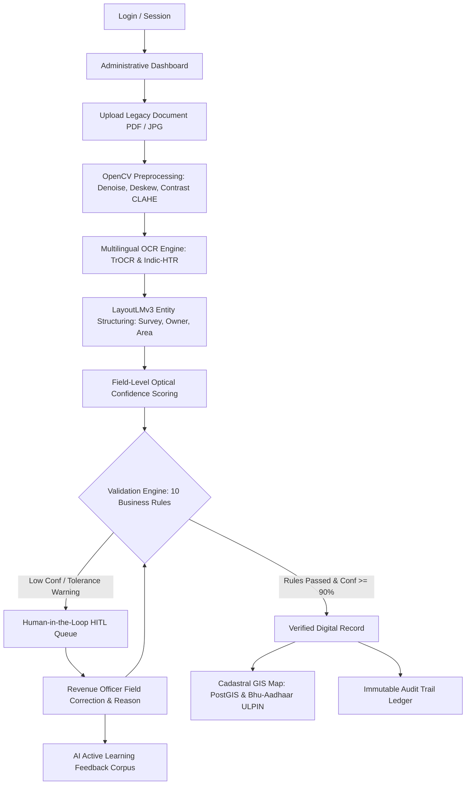

# Intelligent Land Record Digitization and Validation System (ILRDVS)

**Smart India Hackathon 2026 (SIH 2026)**  
**Problem Statement ID:** 26018  
**Ministry / Dept:** Ministry of Rural Development — Department of Land Resources (DoLR)  
**Category & Theme:** Software | Smart Automation  
**Standards:** Compliant with Digital India Land Records Modernization Programme (DILRMP) & Unique Land Parcel Identification Number (ULPIN / Bhu-Aadhaar)

---

## 1. Executive Summary & Problem Overview

Land records form the backbone of land administration, property ownership, taxation, infrastructure planning, and civil dispute resolution in India. A substantial volume of historical land records continues to exist in the form of handwritten registers, scanned documents, cadastral maps, and legacy PDF files. 

Manual digitization is slow, error-prone, and prone to duplicate or fraudulent entries. **ILRDVS** is an enterprise-grade administrative system engineered specifically for land revenue departments to automate the ingestion, image restoration, multilingual OCR/HTR, structured entity extraction, and automated cross-validation of historical land documents against master revenue registries.

---

## 2. Main User & System Workflow



---

## 3. Technology Stack

| Layer | Technologies Selected | Rationale & Scope |
| :--- | :--- | :--- |
| **Frontend** | Next.js (App Router), React, TypeScript, Tailwind CSS | High-performance administrative UI, accessible and type-safe. |
| **Spatial GIS** | Leaflet.js, OpenStreetMap tiles, PostGIS | Real-time cadastral polygon visualization and coordinate lookup. |
| **Backend APIs** | Next.js Route Handlers / Node.js REST API | Modular microservices, clean separation of concerns, JSON responses. |
| **AI / OCR Engine** | Python, FastAPI, OpenCV, TrOCR / Indic-HTR | Non-local means denoising, deskewing, and multilingual extraction. |
| **Database** | PostgreSQL 16 with PostGIS 3.4 | Relational schema with spatial geometries and GIST spatial indices. |
| **Standards** | DILRMP, NGDRS, ULPIN / Bhu-Aadhaar | Direct alignment with Central Ministry technical specifications. |

---

## 4. Key Modules & Features

### 1. Document Ingestion & Storage
- Supports PDF, JPG, JPEG, and PNG (300+ DPI recommended).
- Captures administrative metadata: State, District, Taluk/Tehsil, Village, Document Type (Patta, Chitta, Adangal, Sale Deed, Mutation, Khasra).

### 2. OpenCV Preprocessing Pipeline
- Grayscale conversion and non-local means denoising for faded vintage paper.
- Automatic Hough transform deskewing and adaptive histogram equalization (CLAHE).

### 3. Multilingual OCR & LayoutLMv3 Field Structuring
- Extracts: Owner Name, Father/Husband Name, Survey No, Subdivision, Khasra, Khata, Patta, Land Area, Measurement Unit, Classification, Mutation No, Registration Date.
- Character-level and field-level confidence scoring (High &ge;90%, Medium 70-89%, Low &lt;70%).

### 4. National Indic Document AI & Datasets Benchmark Suite
The platform integrates 7 national-scale open-access Indic OCR, HTR, and Document AI datasets:

| Dataset ID | Script / Language | Task Type | Benchmark CER / WER |
| :--- | :--- | :--- | :--- |
| **`c3rl/IIIT-INDIC-HW-WORDS-Hindi`** | Hindi (हिन्दी / Devanagari) | Word-Level HTR | CER: 4.2% • WER: 10.4% |
| **`c3rl/IIIT-INDIC-HW-WORDS-Tamil`** | Tamil (தமிழ்) | Word-Level HTR | CER: 4.8% • WER: 11.2% |
| **`darknight054/indic-mozhi-ocr`** | Assamese, Bengali, Gujarati | Regional Script OCR | CER: 4.3% (Avg) |
| **`Nayana-cognitivelab/NayanaDocs-Indic-45k-webdataset`** | Bengali (bn) + Indic | Document Layout & VQA | CER: 3.8% • VQA: 92.4% |
| **`Cognitive-Lab/NayanaOCR_Corpus_2025`** | Bengali, Arabic, German | Multilingual Noise OCR | CER: 3.6% |
| **`mvbalaji/tamil-ocr-benchmark`** | Tamil (தமிழ்) | Scanned Archival OCR | CER: 3.9% |
| **`ashtok897/indic-hplt-v2`** | 22 Scheduled Indian Languages | Pre-training & Normalization | Web-scale Corpus |

- Dedicated **Indic Benchmark Suite** (`/htr-studio`) providing:
  - Interactive ground-truth vocabulary browser across Hindi Khasra, Tamil Patta, Bengali Khatian, Gujarati 7/12, and Assamese Jamabandi terms.
  - Document Visual QA (VQA) with bounding box localization (`regions.json` & `vqa.json`).
  - Real-time multi-script inference testing.
  - Ready-to-run Python integration scripts using `datasets.load_dataset()` and `webdataset.WebDataset`.

### 4. 10-Rule Statutory Business Validation Engine
1. **Survey Number Format:** Verifies syntax against state cadastral standards.
2. **Village Master DB Check:** Verifies village existence in taluk master table.
3. **State/District Hierarchy:** Ensures district belongs to selected state.
4. **Positive Extent Check:** Ensures area &gt; 0.
5. **Standard Unit Recognition:** Validates unit (acre, hectare, bigha, sq.m).
6. **Duplicate Record Detection:** Flags matching survey numbers in the same village.
7. **Owner Name Cross-Reference:** Phonetic and orthographic fuzzy match against title registry.
8. **Mutation Stamp Verification:** Checks mutation seal timestamp and optical clarity.
9. **GIS Spatial Area Tolerance Check:** Flags warning if document area deviates from GIS polygon area by &gt;15%.
10. **Encumbrance Check:** Flags court caveats and financial hypothecations.

### 5. Human-in-the-Loop (HITL) Verification Workbench
- Side-by-side view of original scanned document alongside extracted fields.
- Revenue officer can correct any field, leave an official inspection note, and immediately trigger validation re-evaluation.
- Saves correction pairs to `ai_feedback` dataset for offline model fine-tuning.

### 6. Cadastral GIS & Bhu-Aadhaar (ULPIN)
- Interactive polygon overlay on Leaflet map.
- Generates 14-digit ULPIN based on spatial coordinates and cadastral centroid.

### 7. Immutable Audit Trail
- Logs every event: `DOCUMENT_UPLOADED`, `FIELDS_EXTRACTED`, `FIELD_CORRECTED`, `VALIDATION_EXECUTED`, `RECORD_APPROVED`.

---

## 5. Setup & Running Locally

### Prerequisites
- Node.js (v18+ or v20+)
- Python (3.10+)

### 1. Frontend & Next.js Backend
```bash
# Navigate to project directory
cd sih-app

# Install dependencies
npm install

# Run development server
npm run dev
```
Open [http://localhost:3000](http://localhost:3000) in your browser.

### 2. Optional: Python AI Microservice (FastAPI)
```bash
# Navigate to ai-service directory
cd sih-app/ai-service

# Create and activate virtual environment
python -m venv venv
# Windows:
venv\Scripts\activate
# Linux/macOS:
source venv/bin/activate

# Install requirements
pip install -r requirements.txt

# Start FastAPI server
uvicorn main:app --reload --port 8000
```
Interactive Swagger docs available at [http://localhost:8000/docs](http://localhost:8000/docs).

---

## 6. Demonstration Walkthrough Scenario for Judges

1. **Step 1:** Navigate to **Dashboard** to view real-time state progress, pending verification items, and mean confidence metrics.
2. **Step 2:** Open **Documents** and observe the ingested records.
3. **Step 3:** Open **Record #rec-001** (Survey 145/2A, Kovilur Village, Madurai).
4. **Step 4:** Notice the original scanned document on the left and the extracted fields on the right.
   - **Initial State:** Owner name transcribed as `"Ramesh Kumor"` with 72% confidence due to faded ink; Overall status is `REQUIRES_VERIFICATION` with 3 validation warnings.
5. **Step 5:** Click **Edit** on Owner Name, correct it to `"Ramesh Kumar"`, and click **Save Correction & Retest Rules**.
6. **Step 6:** Validation immediately re-evaluates. The Owner rule passes.
7. **Step 7:** Click **Approve & Issue Bhu-Aadhaar**. The record status turns to `VERIFIED`, and the 14-digit ULPIN is confirmed.
8. **Step 8:** Open **Cadastral GIS Map** and search `"145"`. Inspect the parcel boundary and area matching.
9. **Step 9:** Open **Audit Trail** and view the recorded correction event and officer approval.

---

## 7. Compliance & Standards
- Department of Land Resources (DoLR): [https://dilrmp.gov.in](https://dilrmp.gov.in)
- National Generic Document Registration System (NGDRS): [https://ngdrs.gov.in](https://ngdrs.gov.in)
- Unique Land Parcel Identification Number (ULPIN / Bhu-Aadhaar) Technical Guidelines.
