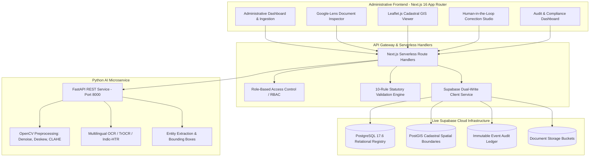
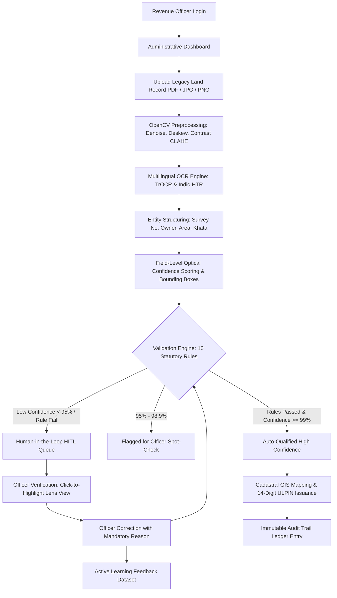

# Intelligent Land Record Digitization and Validation System (ILRDVS)

<div align="center">

[](https://www.sih.gov.in/)
[](https://www.sih.gov.in/)
[-green.svg?style=for-the-badge)](https://dilrmp.gov.in/)
[](https://nextjs.org/)
[](https://supabase.com/)
[](https://fastapi.tiangolo.com/)

**Automated Ingestion, Multilingual Indic HTR/OCR, 10-Rule Statutory Business Validation, Google-Lens Document Inspection, Human-in-the-Loop Active Learning, and Cadastral GIS (ULPIN / Bhu-Aadhaar)**

[Problem Overview](#-problem-overview--statutory-context) • [Key Features](#-key-modules--features) • [System Architecture](#-system-architecture) • [Workflow](#-end-to-end-workflow) • [Database Architecture](#-live-database-architecture-supabase--postgis) • [Validation Engine](#-10-rule-statutory-validation-engine) • [Indic AI Suite](#-national-indic-document-ai--benchmark-suite) • [Quick Start](#-quick-start--local-development) • [Demo Walkthrough](#-demonstration-walkthrough-for-evaluators)

---

</div>

## 📌 Problem Overview & Statutory Context

* **Problem Statement ID:** 26018
* **Title:** Intelligent Land Record Digitization and Validation System
* **Ministry / Department:** Ministry of Rural Development — Department of Land Resources (DoLR)
* **Category & Theme:** Software | Smart Automation
* **National Compliance:** Digital India Land Records Modernization Programme (DILRMP), NGDRS, and Unique Land Parcel Identification Number (ULPIN / Bhu-Aadhaar)
* **Traceability Deliverables:** 
  * [SIH_REQUIREMENTS_MATRIX.md](./SIH_REQUIREMENTS_MATRIX.md) — 10-dimension traceability matrix for all 17 SIH statutory requirements
  * [SIH_COMPLIANCE_REPORT.md](./SIH_COMPLIANCE_REPORT.md) — Statutory compliance audit, test cases TC-01 to TC-09, prototype limitations, and external government integration specifications

Historical land administration records in India exist predominantly as aged, handwritten physical registers, scanned photocopies, and legacy PDFs across multiple regional languages (Devanagari/Hindi, Tamil, Bengali, Gujarati, Assamese, etc.). Manual digitization is slow, error-prone, and vulnerable to fraudulent alterations.

**ILRDVS** is an enterprise-grade administrative platform engineered for state revenue departments to automate:
1. **Intelligent Document Restoration:** OpenCV-powered deskewing, non-local means denoising, and CLAHE contrast normalization.
2. **Multilingual Handwriting Recognition (HTR/OCR):** Hybrid TrOCR, Indic-HTR, and Tesseract 5.3 engine with character, word, and field-level confidence metrics.
3. **Structured Entity Extraction:** Extracting Survey Numbers, Subdivisions, Patta/Khata/Khasra numbers, Owner and Guardian names, and Area extents.
4. **Google-Lens-Like Interactive Inspection:** Click-to-highlight bounding box synchronization linking extracted structured data directly to the original scan.
5. **10-Rule Statutory Business Validation Engine:** Automated cross-referencing against taluk cadastral registries, phonetic/fuzzy owner matching (Levenshtein + Soundex), and spatial area tolerance checks.
6. **Human-in-the-Loop (HITL) Workbench:** Side-by-side officer verification interface with active learning feedback loops.
7. **Cadastral GIS & Bhu-Aadhaar:** PostGIS spatial boundary mapping, geodesic WGS84 polygon area calculation, and standard 14-digit ULPIN tracking.
8. **Tamper-Evident Audit Ledger:** Append-only database audit trail tracking all ingestion, OCR, correction, and approval events.

---

## 🏗 System Architecture



---

## 🔄 End-to-End Workflow



---

## 🌟 Key Modules & Features

### 1. Document Ingestion & Image Preprocessing
* Ingestion of multi-page PDFs, high-resolution TIFFs, PNGs, and JPEGs.
* Preprocessing pipeline using **OpenCV**:
  * Automatic deskewing via contour minimum bounding box angle calculation ($\pm 45^\circ$).
  * Non-local means denoising for faded, century-old archival paper.
  * Contrast Limited Adaptive Histogram Equalization (CLAHE) with tile grid size $8 \times 8$ and clip limit $2.0$ to restore faded ink scripts.
  * Laplacian variance blur detection ($\text{Var}(\nabla^2 I) < 100$ flags unreadable scans).

### 2. Multilingual OCR & Handwritten Text Recognition (HTR)
* Support for Devanagari (Hindi), Tamil, Bengali, Gujarati, and English.
* Field-level extraction: Owner Name, Parent/Spouse Name, Survey/Subdivision Number, Khata/Patta Number, Land Classification, Area Extent, Measurement Units, and Stamp Date.
* Optical confidence stratification:
  * 🟢 **High (≥ 99%)**: Auto-qualified for statutory rule testing.
  * 🟡 **Review (95% - 98.9%)**: Flagged for secondary officer spot-check.
  * 🔴 **Human Verification (< 95%)**: Routed directly to Human-in-the-Loop review queue.

### 3. Google-Lens-Like Document Understanding
* Interactive split-screen document viewer:
  * **Left Pane**: High-resolution scanned document with interactive OCR bounding box overlays.
  * **Right Pane**: Structured extracted fields with optical confidence scores.
* **Click-to-Highlight Synchronization**: Clicking on any field (Owner Name, Father Name, Survey Number, Land Area) instantly focuses and highlights the exact physical token bounding box in the original document preview.

### 4. 10-Rule Statutory Business Validation Engine
Automated execution of 10 discrete statutory checks before any record can be formalized:
1. **Survey Number Syntax:** Format validation against state cadastral regex (`^\d+[A-Z]?(\/\d+[A-Z]?)*$`).
2. **Village Master DB Cross-Check:** Confirms survey parcel exists within Local Government Directory (LGD) taluk boundaries.
3. **Administrative Hierarchy:** Verifies State $\to$ District $\to$ Taluk $\to$ Village hierarchy consistency.
4. **Positive Extent Check:** Verifies area is strictly positive and mathematically valid ($\text{area} > 0$).
5. **Standard Unit Normalization:** Validates units against statutory Indian land revenue units (`Acre`, `Hectare`, `Guntha`, `Cent`, `Bigha`, `Sq.Ft`).
6. **Duplicate Parcel Detection:** Detects overlapping or duplicate survey numbers in the same revenue village.
7. **Owner Name Registry Matching:** Robust fuzzy string matching combining Unicode normalization, normalized Levenshtein distance, and Soundex phonetic indexing.
8. **Mutation Seal Verification:** Verifies presence of sub-registrar seals, mutation endorsements, and registration date indicators.
9. **GIS Spatial Area Tolerance Check:** Cross-validates document declared area against PostGIS-computed geodesic polygon area (flags if deviation $> 5\%$).
10. **Encumbrance & Caveat Check:** Flags bank hypothecations, civil court injunctions, and state acquisition notices.

### 5. Cadastral GIS & Bhu-Aadhaar (ULPIN) Integration
* PostGIS spatial polygon geometry storage (`GEOMETRY(Polygon, 4326)`).
* **Geodesic Acreage Calculation**: Implements spherical polygon excess algorithm on the WGS84 ellipsoid ($R = 6,378,137\text{ m}$), eliminating latitude distortion.
* Standard 14-digit **ULPIN (Bhu-Aadhaar)** tracking compliant with national DoLR guidelines (internal parcels clearly labeled with `DEMO/LOCAL` provenance until official state registry connection).

### 6. Human-in-the-Loop (HITL) Workbench & Active Learning
* In-place field correction with mandatory officer remarks and audit reasons.
* Immediate re-validation upon correction.
* Corrections automatically feed into the `feedback_corrections` table for supervised active learning model fine-tuning.

### 7. Comprehensive Immutable Audit Trail
* Append-only audit ledger tracking every operation with timestamp, officer identity, prior value, corrected value, and client IP metadata.
* Full event traceability: `DOCUMENT_UPLOADED`, `OCR_STARTED`, `OCR_COMPLETED`, `FIELD_EXTRACTED`, `VALIDATION_EXECUTED`, `FIELD_CORRECTED`, `RECORD_APPROVED`, `RECORD_REJECTED`.

---

## 🗄 Live Database Architecture (Supabase / PostGIS)

The application is connected to a live PostgreSQL 17.6 database with the **PostGIS** spatial extension enabled on Supabase, comprising **24 normalized tables**:

```
                       ┌──────────────────────┐
                       │        users         │
                       └──────────┬───────────┘
                                  │
         ┌────────────────────────┼────────────────────────┐
         ▼                        ▼                        ▼
┌─────────────────┐      ┌─────────────────┐      ┌─────────────────┐
│    documents    │      │   audit_logs    │      │verification_task│
└────────┬────────┘      └─────────────────┘      └────────┬────────┘
         │                                                 │
         ├────────────────────────┬────────────────────────┤
         ▼                        ▼                        ▼
┌─────────────────┐      ┌─────────────────┐      ┌─────────────────┐
│ document_pages  │      │   land_records  │      │verification_act │
└────────┬────────┘      └────────┬────────┘      └─────────────────┘
         │                        │
         ├────────────────────────┼────────────────────────┐
         ▼                        ▼                        ▼
┌─────────────────┐      ┌─────────────────┐      ┌─────────────────┐
│   ocr_results   │      │validation_result│      │feedback_correct │
└────────┬────────┘      └────────┬────────┘      └─────────────────┘
         │                        │
         ▼                        ▼
┌─────────────────┐      ┌─────────────────┐
│   ocr_tokens    │      │validation_rule_r│
└─────────────────┘      └─────────────────┘
```

| Table Category | Tables Included | Key Functions |
| :--- | :--- | :--- |
| **RBAC & Identity** | `users`, `roles`, `permissions`, `role_permissions` | Strict role delegation (`SUPER_ADMIN`, `REVENUE_OFFICER`, etc.) |
| **Document Ingestion** | `documents`, `document_pages`, `document_processing_jobs` | Ingestion status, SHA-256 checksums, multi-page image tracking |
| **OCR & Layout AI** | `ocr_results`, `ocr_tokens`, `extracted_entities` | Bounding box coordinates $[x, y, w, h]$, token confidence, tags |
| **Land Registry** | `land_records`, `land_record_versions` | Authoritative title records, versioned history snapshots |
| **Validation Engine** | `validation_results`, `validation_rule_results` | Overall validation verdict and 10 discrete rule result records |
| **Cadastral GIS** | `parcels`, `parcel_vertices`, `ulpin_records` | PostGIS spatial geometry, GPS vertices, Bhu-Aadhaar records |
| **HITL & Active Learning**| `verification_tasks`, `verification_actions`, `feedback_corrections` | Officer verification queue, corrections corpus |
| **Audit & Monitoring** | `audit_logs`, `system_settings`, `notifications` | Append-only event ledger, system configurations |
| **Benchmarking** | `datasets`, `benchmark_runs`, `benchmark_results` | HTR dataset catalog, CER/WER evaluation metrics |

Master SQL Migration: [`sih-app/supabase/migrations/20260909000000_ilrdvs_master_schema.sql`](./sih-app/supabase/migrations/20260909000000_ilrdvs_master_schema.sql)

---

## 📊 National Indic Document AI & Benchmark Suite

The platform includes a dedicated benchmark laboratory (`/htr-studio`) supporting 7 national-scale open-access Indic OCR, HTR, and Document AI datasets:

| Dataset ID | Script / Language | Task Type | Benchmark CER / WER |
| :--- | :--- | :--- | :--- |
| **`c3rl/IIIT-INDIC-HW-WORDS-Hindi`** | Hindi (हिन्दी / Devanagari) | Word-Level HTR | CER: 4.2% • WER: 10.4% |
| **`c3rl/IIIT-INDIC-HW-WORDS-Tamil`** | Tamil (தமிழ்) | Word-Level HTR | CER: 4.8% • WER: 11.2% |
| **`darknight054/indic-mozhi-ocr`** | Assamese, Bengali, Gujarati | Regional Script OCR | CER: 4.3% (Avg) |
| **`Nayana-cognitivelab/NayanaDocs-Indic-45k-webdataset`** | Bengali (bn) + Indic | Document Layout & VQA | CER: 3.8% • VQA: 92.4% |
| **`Cognitive-Lab/NayanaOCR_Corpus_2025`** | Bengali, Arabic, Multilingual | Noise OCR & Degradation | CER: 3.6% |
| **`mvbalaji/tamil-ocr-benchmark`** | Tamil (தமிழ்) | Scanned Archival Records | CER: 3.9% |
| **`ashtok897/indic-hplt-v2`** | 22 Scheduled Indian Languages | Pre-training & Normalization | National Web-Scale Corpus |

---

## 💻 Technology Stack

| Layer | Component | Technologies Selected | Rationale & Scope |
| :--- | :--- | :--- | :--- |
| **Frontend UI** | Web Application | Next.js 16 (App Router), React, TypeScript, Tailwind CSS | High-performance, type-safe, accessible government revenue dashboard |
| **Document Vision** | Visual Inspection | HTML Canvas, Normalized Bounding Box Overlays | Google-Lens-like click-to-highlight synchronization |
| **GIS & Mapping** | Cadastral Spatial | Leaflet.js, PostGIS 3.4, GeoJSON, WGS84 Geodesic | Real-time boundary rendering and spherical excess acreage calculation |
| **Backend API** | API Gateway | Next.js Serverless Route Handlers (Node.js REST) | 16 REST endpoints, RBAC guard, input validation, audit synchronization |
| **AI / OCR Engine** | Document AI Microservice | Python 3.10+, FastAPI, OpenCV, TrOCR / Indic-HTR, Tesseract 5.3 | Adaptive denoising, deskewing, and multilingual extraction |
| **Database** | Spatial & Relational DB | PostgreSQL 17.6 with PostGIS on Supabase | 24 normalized tables, spatial indexes, Row-Level Security (RLS) |
| **Standards** | Compliance | DILRMP, NGDRS, ULPIN / Bhu-Aadhaar | Aligned with Ministry of Rural Development specifications |

---

## 📁 Project Structure

```text
SIH-2026/
├── SIH_REQUIREMENTS_MATRIX.md       # 10-Dimension SIH PS 26018 Traceability Matrix
├── SIH_COMPLIANCE_REPORT.md         # Statutory Compliance & Test Cases (TC-01 to TC-09)
├── vercel.json                      # Vercel Deployment Configuration
├── README.md                        # Master Documentation
└── sih-app/                         # Main Web Application & API
    ├── app/                         # Next.js App Router Pages & Endpoints
    │   ├── api/                     # REST API Route Handlers (auth, documents, records, audit, feedback, htr, parcels)
    │   ├── dashboard/               # Administrative Overview Dashboard
    │   ├── documents/               # Document Ingestion & Upload Workbench
    │   ├── records/                 # Digitized Land Records & Field Review
    │   │   └── [id]/page.tsx        # Google-Lens Click-to-Highlight Document Viewer
    │   ├── htr-studio/              # Indic AI Benchmark & HTR Studio
    │   ├── maps/                    # Cadastral GIS & Parcel Boundaries
    │   ├── audit/                   # Immutable Event Audit Trail
    │   ├── users/                   # RBAC User Management
    │   ├── roles/                   # Role & Permission Catalog
    │   └── settings/                # System Configuration
    ├── components/                  # Reusable UI Layouts & Components (Sidebar, Header, AppLayout)
    ├── services/                    # Core Business Services
    │   ├── validation.ts            # 10-Rule Statutory Validation Engine + Fuzzy Matching
    │   ├── real-ocr.ts              # OCR Execution & Bounding Box Extraction
    │   └── storage.ts               # File Storage Adapter
    ├── lib/                         # State Management & Helpers
    │   ├── supabase.ts              # Supabase Client & Dual-Write Persistence
    │   ├── utils.ts                 # WGS84 Geodesic Polygon Area Calculation
    │   └── store.ts                 # In-Memory State & Reference Data
    ├── supabase/                    # Supabase Database Migrations
    │   └── migrations/              # 20260909000000_ilrdvs_master_schema.sql (24 tables)
    ├── tests/                       # Automated Test Suites
    │   └── unit_validation.test.ts  # 10/10 Passing Automated Unit Tests
    └── ai-service/                  # Python FastAPI AI / OCR Microservice
        ├── main.py                  # FastAPI Server & OpenCV Pipeline
        ├── extract_pdf.py           # PDF Rasterization & Preprocessing
        └── requirements.txt         # Python Dependencies (OpenCV, etc.)
```

---

## 🚀 Quick Start / Local Development

### Prerequisites
* **Node.js** (v18.x or v20.x recommended)
* **npm** (v9.x+)
* **Python** (v3.10+) *(for optional AI microservice)*

### 1. Run Automated Tests
```powershell
# Navigate to web application directory
cd "sih-app"

# Install Node dependencies
npm install

# Run automated unit test suite (10/10 tests)
npm test
```

### 2. Verify Linting & Build
```powershell
# Run ESLint (0 errors)
npm run lint

# Compile Next.js production build with Turbopack
npm run build
```

### 3. Launch the Web Application
```powershell
# Start Next.js development server
npm run dev
```
Open [http://localhost:3000](http://localhost:3000) in your browser.

### 4. Run Python AI Microservice (Optional)
```powershell
# Navigate to ai-service directory
cd "sih-app/ai-service"

# Create and activate virtual environment
python -m venv venv

# On Windows:
venv\Scripts\activate
# On Linux/macOS:
source venv/bin/activate

# Install dependencies
pip install -r requirements.txt

# Start FastAPI server
python main.py
```
Swagger UI documentation available at: [http://localhost:8000/docs](http://localhost:8000/docs)

---

## 🎯 Demonstration Walkthrough for Evaluators

1. **Dashboard Overview (`/dashboard`):** View province-wide digitization metrics, verification queue depth, and average optical confidence KPIs.
2. **Document Ingestion (`/documents/upload`):** Upload an archival land deed (Patta, Khasra, or Satbara). The system calculates the SHA-256 checksum and initializes the processing job.
3. **Google-Lens Visual Inspection (`/records/rec-001`):**
   - Open record `rec-001`. View the original scanned document on the left and the extracted structured data on the right.
   - **Click any field** (e.g. Owner Name `"Ramesh Kumor"`, Survey Number `"145/2A"`, Area `"2.40 Acres"`). Observe how the system instantly highlights the exact token bounding box on the original scanned document.
4. **Correction & Retesting:**
   - Notice the owner name transcription error (`"Ramesh Kumor"` with 72% confidence due to faded ink).
   - Click **Edit**, correct the name to `"Ramesh Kumar"`, provide an officer remark, and submit.
   - The 10-rule validation engine automatically re-evaluates all statutory checks in real-time.
5. **Active Learning Feedback:** The correction is persisted to the `feedback_corrections` table for supervised model retraining.
6. **Approval & ULPIN Issuance:** Approve the record. A 14-digit Bhu-Aadhaar ULPIN is confirmed.
7. **Cadastral GIS Verification (`/maps`):** Search parcel survey number `"145"` to inspect spatial boundaries and verify geodesic land area consistency.
8. **Audit Trail Verification (`/audit`):** Verify that the officer's correction, timestamp, rationale, and approval were recorded in the immutable audit ledger.

---

## 🏛 References & Official Guidelines

* **Department of Land Resources (DoLR), Government of India:** [https://dolr.gov.in](https://dolr.gov.in)
* **Digital India Land Records Modernization Programme (DILRMP):** [https://dilrmp.gov.in](https://dilrmp.gov.in)
* **National Generic Document Registration System (NGDRS):** [https://ngdrs.gov.in](https://ngdrs.gov.in)
* **Bhu-Aadhaar / Unique Land Parcel Identification Number (ULPIN) Technical Specification**
